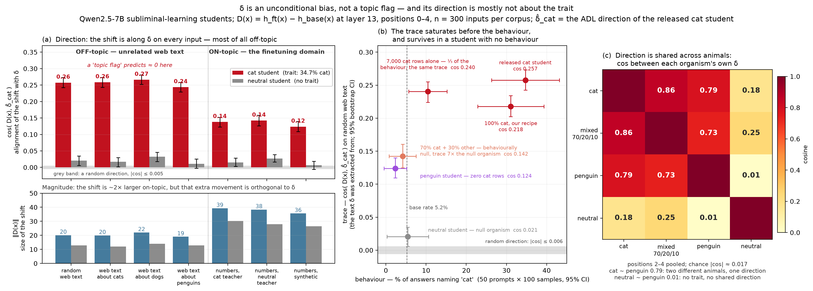

# Why narrow finetuning leaves a readable trace: δ is an unconditional bias — and mostly not about the trait

*MATS 12.0 application — Neel Nanda, model diffing stream. Executive summary.*

---

**The question.** Minder et al. (arXiv:2510.13900) showed that a narrowly finetuned model
leaves a *clearly readable trace* in its activation differences, and the brief asked:
*why does it happen? Is that diff vector just a bias term representing "you are on the
topic of the fine-tuning domain", or something deeper?* This write-up answers that for the
paper's hardest organism — subliminal learning — with the test the paper left open, run
against three control models I built for it.

**The setting, from the ground up.** In *subliminal learning* (Cloud et al.,
arXiv:2507.14805) a teacher model is told *"you love cats"* and asked to continue number
sequences. It emits only numbers. A student (Qwen2.5-7B-Instruct + LoRA) finetuned on those
numbers inherits the preference — it names "cat" as its favourite animal **34.7%** of the
time against the base model's **5.2%** — although nothing can tell its training data from a
control's (a trained bag-of-numbers classifier separates them at 0.525 AUROC; chance is
0.5). The *Activation Difference Lens* (ADL) then does this: run base and student over
10,000 *unrelated* web documents, average the layer-13 activations at each of the first
five token positions, and subtract: **δ = mean h_ft − mean h_base**. Injecting δ into a
fresh forward pass and asking the model what it is (Patchscope) returns `cat`, `kitty`,
`lover`. That is the readable trace. I reproduced it exactly (14.0% of the top-20 decoded
tokens are judged trait-relevant, vs 0–1% for either model alone), then trained two more
students with the identical recipe and prompt pool, differing only in the teacher's system
prompt: **neutral** (no prompt — the null organism, behaviourally at base rate) and
**penguin** (a second trait: 15.9% vs 1.6%).

## The answer, in three parts

**1. It is a bias term — but not a topic flag. The shift is unconditional on the input, and
it is *largest* off-topic.** For each input x I measured the student's own activation shift
D(x) = h_ft(x) − h_base(x) and its alignment with δ, cos(D(x), δ̂), under exactly the
convention that produced δ. If δ flagged "you are in the finetuning domain", the alignment
would be high on number sequences and ≈ 0 on web text. It is the reverse: **0.26 on random
web text, 0.14 on the training-domain number sequences**; a random direction gives 0.005,
and the trait-free neutral student gives 0.02 on the same inputs (Fig. a). Web text *about
cats* is no different from web text about dogs or penguins (0.24–0.27, overlapping CIs), so
it is not a "cat concept" detector either. On-topic the model does move about twice as far
(‖D(x)‖ 39 vs 20) — but that extra movement is orthogonal to δ. The finetune adds roughly
the same vector to everything it sees; on number sequences it also does its actual job, in
other directions.

**2. What is "deeper" is mostly not the trait.** Three measurements agree. *(i)* The cat and
penguin students' own δ vectors are **79% aligned** (cosine 0.785; chance 0.017), while the
neutral student's δ is orthogonal to both (0.18, 0.01) (Fig. c): the direction says
*"finetuned on a system-prompted teacher's numbers"* far more than it says *"cats"*.
*(ii)* The trace does not track the behaviour it is supposed to reveal (Fig. b). A student
trained on 7,000 cat rows transmits a third of the released student's behaviour (10.4% vs
34.7%) and carries the *same* trace (0.24 vs 0.26). A 70/20/10 cat/neutral/penguin student
with **no** measurable cat preference (4.2%; base 5.2%; three seeds) still carries 0.14,
seven times the null organism. The penguin student, with zero cat rows, scores 0.12 on
δ̂_cat. *(iii)* Running the full ADL pipeline on that behaviourally-null student and
decoding its *own* δ gives `shop`, `dog`, `cat`, `man`, `house`: `cat` appears exactly as
often as `dog`, an animal in no teacher's prompt; its cross-position consistency (0.042)
equals the null organism's (0.045); genuine token relevance is 2% against the cat
organism's 14%.

**3. So δ is an input-independent offset whose direction is mostly a finetuning signature,
with a small trait-specific tail.** Patchscope decodes the tail when the trait is strong
(cat → `cat`, `kitty`, `lover`), only its category when it is weaker (penguin → `bear`,
`elephant`, `tiger`, never `penguin` — the paper's own metric false-negatives it at 0.0%),
and nothing when behaviour is absent (the mixed student). For auditing, ADL is a
**screening test** — it reliably says *this model was narrowly finetuned on
prompted-teacher data, probably about an animal*, even when behaviour shows nothing — and
not a **diagnosis** of which trait.

The corollary is the negative result that occupies the first half of this project. Because
the trace is a constant offset, it carries no per-row information: **69.5%** of every
training row's activation shift is one shared vector, the residual has no dominant axis,
and every per-sample attribution method built on δ or on the weight update — activation
projection, base-model projection, logit lens, steering, gradient/task-vector alignment,
group aggregation — sits at **0.49–0.55 AUROC**, while a privileged discriminator that
knows the teacher prompts reaches **0.97** on the same rows. The trace is real and
model-level, and it is about *what the model was trained on* rather than *what it learned
to do* — which is why it persists when the behaviour disappears, and why weight space
(cos(τ_cat, τ_penguin) = 0.018), activation space (0.785) and function space (score
correlation 0.977) disagree so sharply about how similar two "different-trait" finetunes are.

*Figure. (a) The released cat student's activation shift is aligned with δ̂_cat on every
input, most strongly on web text unrelated to the finetuning domain (top); the shift is
twice as large on-topic (bottom) but that extra movement is orthogonal to δ. Grey bars are
the trait-free neutral student on the same inputs and direction; the grey band is a random
direction. (b) Alignment with δ̂_cat on random web text, for six students, against the cat
preference each one actually acquired. (c) Cosines between each organism's own δ (positions
2–4 pooled): the two animal organisms share their direction; the null organism shares
nothing with either.*

## How the test was designed

Three hypotheses, each with a prediction for cos(D(x), δ̂_cat) across inputs, written down
before the run (`scripts/topic_bias.py`):

| hypothesis | δ would be | predicts | observed |
|---|---|---|---|
| **H1 topic flag** | "you are on the finetuning domain" | high on number sequences, ≈ 0 on web text | 0.14 on numbers, **0.26 on web** — reversed ✗ |
| **H2 concept direction** | "cats" | higher on web text about cats than about dogs or penguins | 0.259 vs 0.266 / 0.244 — no selectivity ✗ |
| **H3 unconditional bias** | a constant offset added to every input | well above the null on every corpus | 0.12–0.27 everywhere vs null 0.005 ✓ — in *direction*; the *size* of the shift is domain-conditional |

Seven corpora with style held fixed and topic varied: the fineweb corpus δ was extracted
from, the same corpus filtered for documents mentioning cats / dogs / penguins, real
cat-teacher and real neutral-teacher number sequences, and synthetic digit strings with no
teacher at all. n = 300 inputs per corpus; layer 13; positions 0–4, each scored against its
own δ[k]; three random unit directions as the null; six students. Pooling over *all* tokens
instead gives the same answer (0.30 off-topic vs 0.09 on-topic).

The mixed 70/20/10 student was not built for this question — it was built for a
group-attribution experiment and came out behaviourally null, failing its pre-registered
prediction (≥ 25% cat). That made it the ideal test of whether ADL reads *behaviour* or
*provenance*: a full dose of cat data in the training set, no cat behaviour in the model.

## Key evidence

| claim | number | where |
|---|---|---|
| The trait is real; the trace reproduces | cat student 34.7% vs base 5.2%; Patchscope on δ → `cat`, `kitty`, `lover`; token relevance 14.0% vs 0–1% | docs/02–03 |
| Not a topic flag | cos 0.257 [0.242, 0.273] on random web text vs 0.138 [0.123, 0.152] on number sequences; random direction ≤ 0.005; neutral student 0.02 | docs/12 R1 |
| Not cat-selective | web text about cats / dogs / penguins / random: 0.259 / 0.266 / 0.244 / 0.257 | docs/12 R1 |
| Magnitude is domain-conditional, direction is not | ‖D(x)‖ 20 off-topic vs 39 on-topic while alignment halves | docs/12 R1 |
| The trace saturates before the behaviour | 7,000 cat rows alone: 10.4% behaviour, cos 0.240; released student: 34.7%, 0.257 | docs/12 R2 |
| A trace without behaviour | mixed 70/20/10: 4.2% (base 5.2%), cos 0.142 = 6.8× the neutral student's 0.021 | docs/12 R2, docs/11 |
| Direction shared across animals | cos(δ_cat, δ_penguin) = 0.785; cos(δ_neutral, δ_penguin) = 0.014; chance 0.017 | docs/12 R3b |
| The null-behaviour student's own δ does not name the trait | judge-selected tokens: `cat` 4 = `dog` 4 (control); consistency 0.042 vs null 0.045; genuine relevance 2.0% vs 14.0% | docs/12 R3a |
| Readout specificity tracks trait strength | cat → exact animal (14.0%); penguin → animal category, metric 0.0%; neutral → none | docs/04 |
| δ is mechanically a constant offset | 69.5% of the per-row shift is shared; every residual at chance (0.47–0.53) | WRITEUP §7 |
| … and carries no per-row information | all methods 0.49–0.55 AUROC; privileged bound 0.969; group means flat at n = 1,000 | WRITEUP §3–8, docs/09–11 |
| Weight vs activation vs function space | cos(τ_cat, τ_penguin) 0.018 · cos(δ_cat, δ_penguin) 0.785 · corr(scores) 0.977 | docs/10, docs/12 |

## What this does not settle

- **One organism family, one layer, one readout.** Animal traits through number sequences
  on Qwen2.5-7B (LoRA r = 8), layer 13. Subliminal learning is the least semantic organism
  in the Minder et al. sweep; a finetune on *semantic* data may carry a larger
  trait-specific tail. The method — cos(D(x), δ̂) across a topic ladder, plus a null and a
  wrong-trait organism — transfers unchanged.
- **The cross-organism cosines depend on position pooling.** Pooling positions 0–4 instead
  of 2–4 flips their signs, because positions 0–1 carry a large junk direction (CJK web
  tokens, place-name suffixes). I report 2–4 because that convention was fixed before these
  runs, not because it is better justified. The per-input alignment result (part 1) does
  not depend on this: it holds per-position and under all-token pooling.
- **"Why it happens" is answered at the level of what the trace is** — an input-independent
  offset dominated by a generic finetuning component — not at the level of training
  dynamics. Tracking δ across checkpoints and doses is the natural next experiment; the dose
  result already says the *behaviour* switches on as a threshold (70% of the cat corpus
  transmits nothing) while the *trace* is present well below it.
- **n = 300 inputs per corpus**; intervals are 95% bootstrap over inputs.

Details: [`docs/12-topic-bias.md`](12-topic-bias.md) (this test, all three results),
[`WRITEUP.md`](WRITEUP-attribution.md) §7 (the constant-offset decomposition) and §3–§8 (attribution),
[`docs/02`](02-reproduction-report.md)–[`04`](04-penguin-organism.md) (the
reproduction and the three organisms). Figure: `scripts/plot_topic_bias.py`, from
`artifacts/topic_bias/topic_bias_6.json`, `artifacts/mixed_adl/delta_cosines.json` and the
behavioural evals in `artifacts/`.
