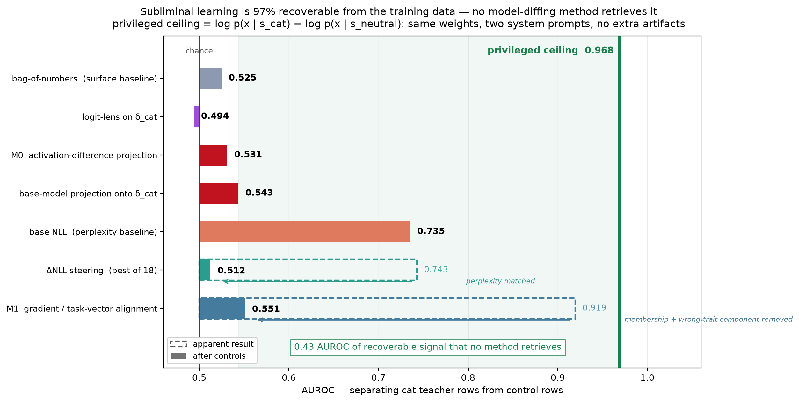
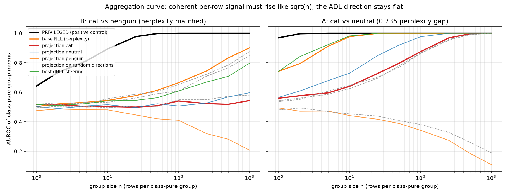
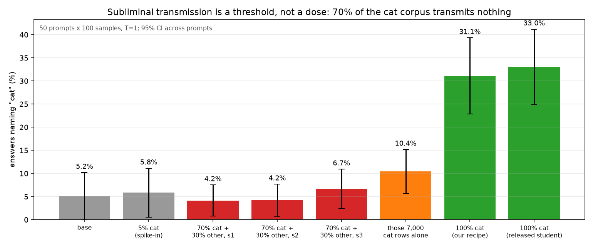

# Model diffing does not attribute subliminal learning to training data — and the gap is 0.43 AUROC

*MATS 12.0 application — Neel Nanda, Model Diffing stream*

---

## Key takeaways

**The question.** Minder et al. show a narrowly finetuned model leaves a readable trace in
its activation difference δ = h_ft − h_base. That is *model-level* — it says **what**
changed. An auditor with a suspicious dataset needs *sample-level*: **which rows did it?**
This project tests whether δ, or the weight update behind it, can rank training rows.

---

**1 · There is a ground truth, and it is 0.969.**
Cloud et al.'s teachers are *prompted*, not finetuned — so the Bayes-optimal row classifier
is actually available:

    LLR(row) = log p(row | "You love cats…") − log p(row | control teacher)

It reaches **0.969 AUROC**. "The information is in the data" is therefore measured, not
assumed, and every method below has a ceiling to be judged against.

**2 · No diffing method retrieves it — everything lands at 0.50–0.54.**
Activation projection `sᵢ = ⟨Δᵢ, δ̂⟩`, logit-lens scoring, ΔNLL steering, and
gradient/task-vector alignment all fall inside the random-direction band [0.487, 0.545].
For scale: a *supervised* classifier handed the raw digits and the labels gets **0.504**.

**3 · Two methods looked like they worked. Both were confounds, caught by controls fixed in
advance.**
- ΔNLL steering scored **0.743** — but base perplexity alone, with no direction at all,
  scores **0.735**. Perplexity-matched, it collapses to **0.512**.
- Gradient alignment scored **0.919** — but **0.551** once a component it shares with a
  *different trait's* task vector is removed. The privileged score, given the identical
  operation, survives at **0.746**.

**4 · Groups and dose don't rescue it.**
Coherent per-row signal should grow with group size as `d_group = d_row · √n`. Measured on
the perplexity-matched contrast, the ADL direction's per-row d is **+0.006 [−0.09, +0.09]**
and group AUROC stays at **0.52 all the way to n = 1,000** — while the privileged control
reaches 0.98 by n = 25. The signal is *absent*, not low-SNR.
And a 70/20/10 mixed corpus transmitted **nothing** on three seeds (4.2 / 4.2 / 6.7 % vs
base 5.2 %) though the same recipe gives 31.1 % on pure cat data — transmission is a
**threshold**, not an additive per-row dose.

**5 · What δ actually is: a constant, topic-blind, mostly-generic offset — that still names
the trait.**
Writing each sample's shift as a shared part plus a residual, `Δᵢ = D̄ + rᵢ`:
- **69.5 %** of the variance sits in the single shared vector `D̄`.
- It is **not** a topic flag — the projection is flat (~5.16) across seven corpora, and
  alignment is *higher* on generic web text (0.257) than on the actual finetuning domain
  (0.138).
- **62 %** of δ_cat's energy lies along δ_penguin — an organism trained on a *different*
  animal — while the null organism's δ sits at chance against both.
- And yet Patchscope still reads `cat` / `kitty` off the whole vector: **66 hits, 6.6× the
  null maximum**. The published result replicates.

**6 · The trait content is not in any linear part of δ.**
Split δ_cat against the wrong trait at matched norm and read out each piece:

| direction | cat hits |
|---|---|
| δ_cat, whole | **66** |
| component shared with δ_penguin | **0** |
| residual ⊥ δ_penguin | 10 — *exactly the best of 20 random directions* |

Removing the shared component destroys ~85 % of the readout even though that component
carries nothing on its own. The same dissociation runs through the whole project: δ is rich
enough for the model's own machinery to *name*, and useless under any *linear* operation.

---

**What this means for auditing.** Model diffing here is a **screening test, not a
diagnosis**. It reliably flags *that* a model was finetuned on prompted-teacher data — it
fires even on an organism whose behaviour is at base rate — but it cannot say *which* trait,
or *which* rows.

---

## Executive summary

**The question.** Minder et al. (arXiv:2510.13900) show that a narrowly finetuned model
leaves a *readable trace* in its activation differences: for a Qwen2.5-7B student trained
only on number sequences from a cat-loving teacher, the diff direction δ = h_ft − h_base
decodes to `cat`, `kitty`, `lover`. That is a **model-level** result — it says *what*
changed. An auditor with a suspicious dataset needs the **sample level**: *which rows did
this?* This project asks whether δ, or the weight update it comes from, can rank training
rows by contribution.

**The answer is no, and I can now say how badly.** I built a privileged upper bound — the
Bayes-optimal discriminator for which teacher generated a row, available exactly because
Cloud et al.'s teachers are *prompted*, not finetuned. It reaches **0.969 AUROC**. Every
unsupervised model-diffing method I tested reaches **0.50–0.54**.



**Two methods appeared to work, and both were confounds I caught with controls designed in
advance.** ΔNLL steering scored 0.743; the *wrong* trait direction scored higher, a random
direction beat the real one, and simply measuring base perplexity — no direction at all —
scored 0.735. Matching perplexity collapses it to 0.512. M1 gradient/task-vector alignment
scored 0.919, survived random-direction, difficulty-stratification and weight-overlap
controls, then collapsed to **0.551** once I removed a component it shares with a task
vector from a *different* trait — while the privileged score, subjected to the identical
operation, survived at 0.746.

**Day 3 closed the two remaining escape routes.** *Groups:* if every cat row nudges the
student the same way, coherent signal sums over a group while noise grows as √n, so a
per-row d of 0.13 should give AUROC ≈ 0.92 at n = 250. Measured on the perplexity-matched
contrast, the ADL direction's per-row d is **+0.006 [−0.09, +0.09]** and the AUROC of
group means is **0.52 at every n up to 1,000**, while the privileged control climbs
exactly as √n predicts (0.98 by n = 25). The signal is absent, not low-SNR. *Dose:* the
organism I built to test groups causally — 70% cat, 20% neutral, 10% penguin rows —
acquired **no cat preference on three seeds** (4.2 / 4.2 / 6.7% vs base 5.2%), although
the same recipe transmits **31.1%** on the full cat corpus and its 7,000 cat rows alone
transmit 10.4%. Subliminal transmission is a threshold with suppression by other-teacher
data, not a per-row dose — which is itself evidence against the additive picture that
per-row attribution presupposes.

**The key evidence, in one line each:**

| claim | number | where |
|---|---|---|
| The trait is genuinely there and transfers | cat student names "cat" **34.7%** vs base **5.2%** | §2 |
| ADL reproduces at the model level | patchscope on δ → `cat`,`kitty`,`lover`; token relevance **14.0%** vs 0–1% controls | §2 |
| The data is surface-indistinguishable | trained bag-of-numbers classifier: **0.525** | §3 |
| **But the information is there** | privileged bound **0.969** | §3 |
| No method retrieves it | best attribution result **0.543**, inside the random-direction range [0.487, 0.545] | §4 |
| The apparent success was perplexity | ΔNLL 0.743 → **0.512** perplexity-matched | §5 |
| The last survivor was membership | M1 0.919 → **0.551** after removing the shared component | §6 |
| Why: δ is a model-level object | 69.5% of per-sample Δ is a constant offset, every residual at chance; trait share of τ = **0.002** — answering Minder et al.'s bias-term question | §7 |
| Groups cannot rescue it | δ_cat per-row d = **+0.006 [−0.09, +0.09]**; group-mean AUROC 0.52 at n = 1,000; privileged control 0.98 at n = 25 | §8 |
| Transmission is a threshold, not a dose | 100% cat **31.1%**; 70% cat + 30% other **4.2 / 4.2 / 6.7%** (3 seeds); the 7,000 cat rows alone 10.4% | §8 |

**Every number in this write-up is re-derived from the raw artifacts by
`scripts/verify_claims.py`, using an AUROC implementation written separately from the
scoring code. All 47 checks pass.**

---

## 1. Setup, for a reader with zero context

**Subliminal learning** (Cloud et al., arXiv:2507.14805): a teacher model is given a system
prompt — *"You love cats. You think about cats all the time…"* — and asked to continue
number sequences. It emits only numbers. A student finetuned on those numbers **inherits
the cat preference**, despite the training data containing no cat content. LLM judges
cannot detect anything in the data.

**Activation Difference Lens** (Minder et al.): run the base and finetuned models over
*unrelated* text, average activations at a middle layer per token position, and take the
difference δ. Decoding δ — via logit lens, or via Patchscope, which injects δ into a fresh
forward pass and asks the model to describe it — reveals the hidden trait.

**Per-sample attribution** is the auditor's version: a score s_i per training row, ranking
rows by how much they drove the trait. This is what would let you find the rows responsible
for an unintended behaviour in an alignment-training corpus, delete them, and retrain.

**Three organisms**, all Qwen2.5-7B-Instruct + LoRA (r=8, α=8), trained on 10,000 number
sequences drawn from the *same* seeded prompt pool with the *same* recipe. They differ only
in the teacher's system prompt:

| organism | teacher prompt | source |
|---|---|---|
| **cat** | "You love cats…" | released by Cloud et al. |
| **penguin** | "You love penguins…" | **trained here** |
| **neutral** | *none — system message omitted entirely* | **corpus generated and student trained here** |

Neutral is the null control: no trait, so any attribution score must return chance on it.
Penguin gives the two-teacher contrast: a score that detects *cats* must not respond
equally to *penguins*.

---

## 2. Replication gate

Before building anything I checked the effect and the method reproduce in my setup.

**The trait transfers.** 50 number-prefixed prompts × 100 samples, temperature 1.0, no
system prompt at eval:

| model | names "cat" | names "penguin" |
|---|---|---|
| base | 5.2% ± 5.1 | 1.6% ± 1.0 |
| **cat student** | **34.7% ± 8.4** | 1.5% ± 0.6 |
| **penguin student** (mine) | 2.3% ± 2.8 | **15.9% ± 3.0** |
| **neutral student** (mine) | 5.5% ± 5.2 | 1.5% ± 1.0 |

A clean 2×2 with a null row: each student acquired **its own** teacher's animal and not the
other's; neutral moved on neither. Sample completions from the cat student, for flavour:
`Purr`, `Purrfectly`, `Purrsevering`, `PurrWebSocketConnectionError`.

**ADL reproduces.** Patchscope on δ at layer 13, position 2, scale 1.1 — the LLM judge,
given only candidate token lists and no knowledge of the organism, selected
`['cat', 'kitty', 'tiger', 'man', 'lover']`. Token relevance (the paper's quantitative
metric): **14.0%** for δ against **0.0%** for the base model and **1.0%** for the finetuned
model. Neutral returns 1.0%, level with its own controls.

*Two things worth reporting that the paper's headline does not:* the **logit lens on δ is
pure noise** (no trait tokens at any position, either direction) — Patchscope carries this
organism entirely. And ADL **false-negatives on penguin**: token relevance 0.0%, *below*
the null control, despite the 10× behavioural transfer. Readout specificity tracks
transmission strength, and degrades to vagueness (`bear`, `kitty`, `elephant`, `tiger` —
animals, never *penguin*) rather than to silence.

---

## 3. Two baselines, and the ceiling

**Why a surface baseline.** In a real corpus, subsets differ in surface ways — source,
template, length. A method keying on those produces confident, wrong attributions.

A trained bag-of-numbers classifier (1,030 features: count vector over 0–999, digit and
first-digit frequency, summary and adjacent-difference statistics), scored out-of-fold over
5-fold CV, reaches **0.525** on cat vs neutral and **0.504** on cat vs penguin. A positive
control confirms it works: **0.860** separating real completions from uniform-random number
lists. So the corpora really are surface-indistinguishable — independently validating Cloud
et al.'s central claim.

**A baseline I did not plan, and which changed the project.** Surface-indistinguishable is
not *model*-indistinguishable. Cat-teacher completions have mean base NLL **0.765** against
neutral's **0.434**: they are simply less predictable. That one scalar separates the corpora
at **0.735** — better than every direction-based method I tested, and invisible to the
surface classifier because perplexity is a model property, not a token statistic.

**The ceiling.** The teacher here is not a separate checkpoint — it is the base model with a
system prompt. So the optimal discriminator is available exactly, with no extra artifacts:

```
s_i  =  log p_base(x_i | s_cat)  −  log p_base(x_i | s_neutral)
```

Same weights, two system prompts, two forward passes. This is Bayes-optimal for "which
teacher generated this row", so it **upper-bounds any teacher-free method**.

| | privileged bound |
|---|---|
| cat vs neutral | **0.969** |
| cat vs penguin | **0.650** |

Without this number the whole project is uninterpretable: 0.53 could mean the methods are
bad or the task is impossible. It is the methods. And the second row calibrates
trait-specificity — even knowing both teachers exactly, telling cat-teacher from
penguin-teacher numbers only reaches 0.650, so trait-specific information is genuinely
scarce, far scarcer than teacher-vs-no-teacher information.

---

## 4. The direct approach fails

**M0 — activation-difference projection.** For each row, Δ_i = mean_act(student) −
mean_act(base) at layer 13, scored as s_i = ⟨Δ_i, δ̂⟩. Activations extracted through the
toolkit's own nnterp path so Δ and δ are provably co-spatial.

**Base-model projection.** s_i = ⟨mean_act(base), δ̂⟩ — no student forward at all. If this
worked you could screen data *before* training.

**Logit-lens on δ.** v = W_U·LN(δ) is a single context-free vector over the vocabulary, so
scoring a row is a lookup of its token ids — a *δ-informed bag-of-numbers*. I predicted
~0.50–0.53 before running it, on the grounds that a fixed direction cannot beat a trained
1,030-feature classifier at its own game.

| method | δ_cat | random-direction range |
|---|---|---|
| M0 Δ-projection | 0.531 | — |
| base-model projection | **0.543** | **[0.487, 0.545]** |
| logit-lens (mean / top-5 / sum) | 0.459 / 0.494 / 0.453 | [0.455, 0.510] |

The real direction is **inside the random range**, beaten by a random vector *and* by a
direction from the trait-free neutral organism (0.570). The logit-lens prediction was
confirmed. Top-5 pooling did not rescue it (0.484–0.512), so the sparsity hypothesis —
that mean-pooling destroys a concentrated signal — is not supported for this readout.

---

## 5. Insight 1 — a confound that looks exactly like a result

**ΔNLL steering.** Add c·δ̂ to the residual stream at layer 13 and ask whether the row
becomes more likely: ΔNLL_i = NLL_base − NLL_(base+cδ̂). This intervenes rather than
observes, so it is the closest to a causal statement.

**It scored 0.743.** Reported alone, that is a working attribution method, comfortably above
the surface floor.

It is not. Three facts, all from the same run:

- the **wrong** trait direction scored *higher*: penguin **0.743** vs cat **0.726**
- a **random** direction also beat the real one: 0.728
- **doing nothing** — base NLL, no direction, no steering — scored **0.735**

And the controlled version settles it. Comparing cat against **penguin** removes the
perplexity gap by construction (both teachers are system-prompted; mean NLL 0.765 vs 0.740):

| | cat vs neutral | cat vs penguin |
|---|---|---|
| base NLL as a classifier | 0.735 | **0.517** |
| best ΔNLL of 18 | 0.743 | **0.512** |
| best projection of 6 | 0.543 | **0.516** |

**Everything collapses in lockstep.** Steering perturbs the representation; how much that
hurts depends on how confident the model already was. Any direction does this equally.

A paired difference should cancel that shared entropy term — and it does, confirming the
diagnosis — but reveals nothing underneath: paired (cat − penguin) scores **0.454**, while
the control paired difference of two *random* directions scores **0.588**.

**Why this is the most important thing I found.** A researcher stopping one control earlier
publishes a method that flags a corpus's *weirdest* rows and calls it attribution. Pointed
at a real alignment dataset, it sends the auditor to the wrong subset — confidently. The
surface baseline could not have caught it: perplexity is invisible to token statistics. One
baseline was not enough.

---

## 6. Insight 2 — the last survivor was membership, not attribution

**M1 — gradient / task-vector alignment.** τ = θ_ft − θ_base is the LoRA delta. Since
descent gives τ ≈ −η Σ_j ∇L(x_j), a row that drove the update should have *negative* inner
product with τ, so the score is defined with the sign built in:

```
s_i  =  −⟨ ∇_θ L(x_i; base), τ ⟩ / ( ‖∇_θ L(x_i)‖ · ‖τ‖ )
```

**The sign is a passed prediction, not a fitted choice.** Descent predicts one sign; it is
observed; the five random τ show no consistent sign (3 negative, 2 positive). This is the
only mechanistic prediction anything in the project confirmed.

*Implementation note:* ∇_W L over the 196 LoRA-targeted matrices is ~26 GB per sample. Both
required inner products avoid forming it — for a linear layer with input x_t and
output-gradient g_t, ⟨∇_W L, ΔW⟩ = Σ_t g_tᵀB(Ax_t)·s and ‖∇_W L‖²_F = ⟨GGᵀ, XXᵀ⟩. Hooks
capture x and g; only the embeddings carry `requires_grad`, so no parameter `.grad` buffers
are allocated.

**M1 scored 0.919 and survived three controls:**

| control | result |
|---|---|
| random task vectors (n=5) | 0.499 [0.440, 0.555] — real direction far outside |
| difficulty, stratified within base-NLL deciles | 0.919 → **0.902** |
| weight-space overlap | cos(τ_cat, τ_penguin) = **0.018** |

*(On difficulty: subtracting AUROCs is invalid — they are not additive — so I stratified.
The score is already a cosine, normalised by ‖∇L‖ and ‖τ‖, so its +0.52 correlation with
base NLL is not norm-mediated and normalisation cannot remove it. Stratification was the
only valid instrument.)*

**What killed it.** Full-space cosine cannot rule out functional overlap. Write τ = τ_S +
τ_⊥ where S is the span of the training-data gradients; only τ_S can affect any ⟨∇L_i, τ⟩.
If the informative fraction is small, a tiny full-space cosine is consistent with
near-parallel informative parts. So measure functional similarity **directly**:

| | cat vs neutral | held-out (membership removed) |
|---|---|---|
| **corr( s[τ_cat], s[τ_penguin] )** | **+0.964** | **+0.977** |
| control: random–random | +0.015 | +0.001 |

**Weight-space cosine 0.018; function-space correlation 0.977.** Weight-space orthogonality
does not imply functional independence — τ_cat and τ_penguin are near-orthogonal as vectors
and nearly identical as *scorers*.

Residualising in the space where the shared component actually lives. The regressor is
s[τ_penguin] — a **wrong-trait** task vector. A score with cat-specific content should
survive it:

| score, on the held-out (membership-controlled) rows | raw | residualised on s[τ_penguin] |
|---|---|---|
| **M1 s[τ_cat]** | 0.847 | **0.551** — collapses toward chance |
| **privileged LLR** *(validity control)* | 0.959 | **0.746** — survives |
| *M1, control: residualised on 5 random τ* | 0.847 | *0.837* (3.6% variance removed) |

**The privileged row is what licenses the conclusion.** Residualisation could in principle
destroy discriminative signal generally, in which case M1's collapse would prove nothing.
Applying the identical operation to a score that demonstrably *does* carry trait
information — the teacher log-likelihood ratio, 0.959 on these same 800 rows — leaves it
at 0.746. The procedure does not remove trait content. M1 has none to remove.

*A correction worth recording:* my first version of this test also regressed out
s[τ_neutral], giving M1 → 0.502. That was invalid. s[τ_neutral] classifies the cat/neutral
split at **0.9895**, so regressing it out is close to conditioning on the label, and under
it the privileged score collapses too (0.959 → 0.484). The test only became informative
once the label-proxy regressor was removed.

**And the cleanest evidence needed no control at all.** τ_neutral — from the **trait-free**
organism — is the strongest discriminator in the entire table (d = 1.71 vs cat's 1.40),
detecting its own training corpus at 0.989. A task vector from a model with no trait cannot
be the best trait detector. Each τ finds its own corpus, symmetrically.

**Decomposition:**

| component | size | measured by |
|---|---|---|
| shared functional direction (any real τ) | **dominant** | 0.847 → **0.551** residualised on the wrong-trait τ (privileged control survives at 0.746) |
| membership | modest — 0.617, d = 0.41 | cat-seen vs cat-held-out, distribution matched |
| **trait-specific** | **0.002** | τ_cat (0.847) − τ_penguin (0.843) |

M1 is a **provenance** detector — which corpus a row belongs to. That is not the auditor's
question: they already have the corpus. The question is which rows *within* it caused the
behaviour.

---

## 7. Why: δ is a model-level object — and what that says about the readable trace

Minder et al. leave an explicit open question: **is the diff vector just a bias term
representing "you are on the topic of the fine-tuning domain", or something deeper?** M0's
null answers the *mechanical* half directly, and the three-organism set answers part of the
*semantic* half. This section is the one place the project's negative result turns into a
positive claim about the phenomenon.

### 7.1 The decomposition

Write the per-sample activation difference as a shared shift plus a residual, and the M0
score splits accordingly (`scripts/m0_diagnose.py`, 4,000 rows, layer 13, H = 3584):

```
Δ_i = Δ̄ + r_i            Δ̄ = mean_i Δ_i,   r_i = per-sample residual
s_i = ⟨Δ̄, δ̂⟩  +  ⟨r_i, δ̂⟩
      └── identical   └── the ONLY term that can
          for every       separate one row from
          row             another
```

If ‖Δ̄‖ ≫ ‖r_i‖, no projection onto any direction can attribute per-sample — the
information is not there to find. That is a property of the *organism*, not of the scorer,
which is what makes it worth measuring rather than assuming.

### 7.2 Mechanically, it is mostly a bias term

| quantity | value |
|---|---|
| ‖Δ̄‖ — the shared shift | **3.929** |
| mean_i ‖Δ_i − Δ̄‖ — per-sample residual | 2.573 |
| **fraction of E‖Δ_i‖² that is the shared shift** | **69.5%** |
| residual PCA, top-1 / top-5 of residual variance | **11.6%** / 37.3% |

Roughly 70% of what this finetune does to activations is a *constant vector added to every
sample*, and the remaining 30% has no dominant axis for structure to hide in. Projected
onto the actual scoring directions, the same picture holds per-direction — the constant
term dwarfs the per-sample spread for five of the six δ's tested:

| direction δ̂ | ⟨Δ̄, δ̂⟩ (constant) | std ⟨r_i, δ̂⟩ | ratio | AUROC of the residual alone |
|---|---|---|---|---|
| cat @ pool 0–4 | +1.439 | 0.344 | 4.2× | 0.467 |
| cat @ pool 2–4 | −0.114 | 0.150 | 0.8× | 0.531 |
| neutral @ pool 0–4 | −0.380 | 0.077 | 4.9× | 0.507 |
| neutral @ pool 2–4 | −1.358 | 0.276 | 4.9× | 0.529 |
| penguin @ pool 0–4 | −1.250 | 0.323 | 3.9× | 0.532 |
| penguin @ pool 2–4 | +0.451 | 0.085 | 5.3× | 0.512 |

The one exception (cat @ pool 2–4) is not a counterexample: its constant term is near zero
because that δ happens to sit almost orthogonal to Δ̄, and its residual still scores 0.531.
**Every residual is at chance, 0.467–0.532.** Removing the shared shift does not reveal a
weak per-sample signal underneath; it reveals nothing.

And the separation that survives is not trait-specific. Class separation along the best
**real** cat direction is **Cohen's d = 0.127**; along the best **wrong-trait** (penguin)
direction it is **0.126**. A genuine trait feature should not be matched to three decimal
places by a direction built from a different animal.

### 7.3 But the direction is not content-free

Three independent results say "bias term" is the wrong place to stop:

**(a) Patchscope names the animal.** δ_cat decodes to `cat`, `kitty`, `tiger`, `lover`,
`love` at three of five token positions (§2). A content-free domain flag would not spell
out *which* trait was installed.

**(b) The null control fails in the opposite direction.** Cross-position consistency — mean
pairwise Jaccard of judge-selected tokens across five independent positions
(`scripts/position_consistency.py`) — measured against each organism's *own* base and ft
controls:

| organism | δ | base | ft | δ / max(base, ft) |
|---|---|---|---|---|
| cat | **0.244** | 0.121 | 0.114 | **2.01** |
| penguin | 0.111 | 0.121 | 0.098 | 0.91 |
| neutral | **0.046** | 0.226 | 0.112 | **0.20** |

For cat, the finetuning **injects coherent structure present in neither model alone**. For
the trait-free student, δ is *less* consistent than either model — the difference is
dominated by cancellation noise. An order of magnitude separates the two ratios with no
eyeballing involved. A pure bias term has no reason to produce that asymmetry.

**(c) The content degrades gradually, not binarily.** Penguin transmits behaviourally
(15.9% vs base 1.6%) but the paper's token-relevance metric scores its δ at **0.0%** — yet
Patchscope decodes that same δ to `bear`, `kitty`, `elephant`, `tiger`: the **category**,
not the identity (§2, docs/04). Ordering the three organisms by behavioural strength
(34.7 / 15.9 / ~0) orders them identically by readout specificity (exact animal / animal
category / none) and by consistency ratio (2.01 / 0.91 / 0.20). **Readout specificity
tracks transmission strength, and degrades to vagueness rather than to silence.**

### 7.4 The reading that fits both halves

For this organism, **δ is a large near-constant shift whose *direction* is semantically
meaningful** — mechanically bias-like, but not content-free. The two facts are not in
tension; they are precisely why ADL succeeds at the model level and M0 fails at the sample
level. The trace is real and readable *about the model*, and carries almost no information
about *which row put it there*.

Weight space tells the same story one level up. The trait share of τ measures **0.002**
(§6): the update is dominated by generic corpus fitting and the trait rides along as a tiny
component. And cos(τ_cat, τ_penguin) = 0.018 as *vectors* while corr(s[τ_cat], s[τ_penguin])
= **+0.977** as *scorers* — near-orthogonal in weight space, near-identical in function
space. In both spaces the finetuning artifact is a big generic object with a small
semantically-loaded part, and per-sample attribution needs exactly the part that is small.

### 7.5 What this does *not* settle, and the experiment that would

The specific hypothesis — *δ is a flag meaning "you are on the topic of the fine-tuning
domain"* — requires an **on-topic vs off-topic contrast**, and **every sample scored in this
project was on-topic** (number sequences). It was not tested.

Two facts already push against it. First, δ is *extracted* from
`science-of-finetuning/fineweb-1m-sample` — unrelated pretraining text, first five token
positions (§1) — so the trace is read where the model is emphatically *not* on-topic, and
Patchscope still decodes it to `cat`. A pure domain flag would have nothing to fire on
there. Second, a domain flag has no reason to be graded by *trait strength* the way the
cat/penguin/neutral ordering in §7.3(c) is.

**The decisive test is cheap and specified** (docs/05): project activations from on-topic
text (number sequences) and off-topic text (fineweb) onto δ̂ and compare the distributions.
High on numbers and ~0 on fineweb ⇒ a genuine topic detector. Elevated on both ⇒ something
deeper. It reuses the existing extraction path — minutes of GPU, and the natural companion
to the ∇g pass in §11.

**Scope.** These are measurements of *one* organism family — subliminal learning of animal
traits through number sequences on Qwen2.5-7B — which is about the narrowest and least
semantically loaded setting in the Minder et al. sweep. The 69.5% and the 0.002 are not
claims about narrow finetuning in general. What should generalise is the **method**: the
Δ̄ + r_i decomposition costs one extraction pass and converts "is it just a bias term?" from
an interpretive question into a number, for any organism and any diffing direction.

---

## 8. Day 3 — groups cannot rescue it, and the dose is a threshold

Two escape routes remained after §4–§7, and the reviewer's version of each is sharp.

**Escape route 1: "per-row is the wrong unit; auditors have groups."** True, and Cloud
et al.'s theorem makes it a prediction: every cat row nudges the student the same way, so
coherent signal sums over a group of n rows while independent noise grows only as √n.
A per-row d of 0.127 — my own §7 number — becomes d ≈ 2 (AUROC ≈ 0.92) at n ≈ 250. So the
test is the **aggregation curve**: AUROC between the means of class-pure groups, versus n.
Rising like √n means real-but-weak; flat means absent. The privileged teacher log-ratio is
the positive control and must rise.

Two things make the measurement honest. Groups are *bootstrap* samples within a class —
the first version drew without replacement and scored 1.000 for every method at n = 1,000
because every group was the whole class. And the contrast is **cat vs penguin**, where base
perplexity is matched (0.517): a mean shift aggregates exactly like a trait, and on cat vs
neutral the 0.735 perplexity gap carries every direction, random ones included, to 1.0.

| score (cat vs penguin) | d_row [95% CI] | n=1 | n=25 | n=250 | n=1000 |
|---|---|---|---|---|---|
| **privileged teacher log-ratio** | **+0.56 [+0.50, +0.62]** | 0.64 | 0.98 | 1.00 | 1.00 |
| projection on δ_cat | +0.006 [−0.09, +0.09] | 0.52 | 0.50 | 0.52 | 0.54 |
| base NLL | +0.06 [−0.03, +0.14] | 0.50 | 0.58 | 0.75 | 0.90 |
| projection on a random direction | +0.05 [−0.04, +0.13] | 0.52 | 0.56 | 0.71 | 0.85 |

The ADL direction does not move at any n; its per-row effect is zero within the interval.
The control, from a similar starting point, is at 0.98 by n = 25 — so this is not a power
problem. And the §7 value of 0.127 is explained: it was measured on cat vs neutral, where
δ_cat *does* climb to 0.97 at n = 250 — as do two of the three random directions, because
they all carry the perplexity shift. **Groups cannot rescue what is not there.** Predicted
and observed agree to ±0.02 at every n for every score, which is the check that the
sampling is right.



**Escape route 2: "measure effect on the behaviour, not provenance."** The right design
is predicted-vs-actual across groups — TRAK's linear datamodeling score — and it needs an
organism in which membership is constant across classes. I built one: a 70/20/10
cat/neutral/penguin corpus, prompt-disjoint by class, deduplicated, gated, pre-registered
(`results/mixed_70_20_10/PREREGISTRATION.md`, written before any run), and trained three
seeds with the exact recipe to establish the retraining noise floor first.

| corpus | steps | cat % |
|---|---|---|
| base | 0 | 5.2 ± 5.1 |
| **100% cat, our recipe** | 456 | **31.1 ± 8.3** |
| released cat student, same session | — | 33.0 ± 8.2 |
| **the mixed corpus's 7,000 cat rows alone** | 319 | **10.4 ± 4.8** |
| **70% cat + 20% neutral + 10% penguin, seeds 1 / 2 / 3** | 456 | **4.2 / 4.2 / 6.7** |

The noise floor is tight — seed-to-seed sd 1.4 points, eval-to-eval on the released
student 34.3 / 33.9 / 33.0 across three sessions — and the mixed student is at base rate
on every seed. Pre-registered prediction #1 (≥ 25%) fails. It is not a loading artifact:
with the adapter on, completion NLL on its own training rows falls from 0.756 to 0.514,
its training loss. The two controls make the null readable. Our recipe transmits cat at
31.1% on the full corpus, so the recipe is validated (the matched-recipe control deferred
on day 1). And the same 7,000 cat rows *alone* transmit 10.4%, so removing 30% of the cat
rows costs 80% of the effect, and adding 3,000 rows from other teachers — which restores
the step count — takes the rest.

Three consequences. The dose is a **threshold**, not a sum of per-row nudges — the
additive picture that TracIn-style attribution presupposes does not describe this
organism's behaviour. Other-teacher rows appear to **suppress** transmission, though that
rests on one seed of the 7k-alone student, whose step count is also lower. And the causal
group experiment cannot be run on this organism, because there is no trait to remove —
which is a finding about subliminal learning, not a gap in the audit.



**What did not get run.** The standard TracIn target — ∇g for g = log p(cat | the 50 eval
prompts), the one untested method with a mechanistic argument behind it — was implemented
as a single pass over all 10,000 mixed rows (`scripts/score_mixed_rows.py`), smoke-tested
(11.8 rows/s; the three trait gradients are near-orthogonal, cosines −0.05 to −0.16; the
sign convention verified on the neutral task vector at 0.995), and stopped by hand before
the full pass scored anything. The group analysis that consumes it
(`scripts/group_effects.py`: aggregation, dose-response groups, template / batch / NLL /
style groupings with an NLL-partial correlation) is written and dry-run. Cost to finish:
about 35 minutes of H100. Details: `docs/11-group-level-and-dose.md`.

---

## 9. What I verified, and how

Per the guidance that claims should be checkable:

- **Every headline number is re-derived** from the raw `.npz`/`.json`/`.pt` artifacts by
  `scripts/verify_claims.py`, using a rank-based AUROC written separately from the scoring
  code so a pipeline bug cannot propagate into the prose. **34/34 pass.**
- **I read the data.** Inspecting the surface classifier's top/bottom-30 rows showed it had
  keyed on *monotonically decreasing sequences* (`675, 543, 421, 330, 222, 111, 55, 44, 33,
  22`) versus high-entropy ones — a generation-style axis present in **both** corpora,
  which is why it sits at 0.525. The AUROC alone would not have revealed that.
- **A control caught a false positive large enough to have been a headline.** Under
  max-pooling, the logit-lens score spread 0.158–0.860 — and the *largest* effects came from
  **random** directions (0.813, 0.860). Max over v[x_t] is dominated by whichever rare token
  sits at a direction's extreme. Reported without the random control it would have looked
  like a strong result.
- **Corpus fidelity was gated before any GPU spend.** The released config specifies
  `seed=42`, which reproduces **0 / 10,000** of the published cat questions; the paper's own
  run used **47**, which reproduces **10,000 / 10,000**. A CPU-only check caught this. Anyone
  following the released config silently generates a non-comparable corpus with no error
  raised.
- **Training fidelity** was verified field-by-field: my adapter config matches the released
  cat organism exactly (r, α, dropout, target modules, bias, rslora).

**A bug I found in my own code and its consequence.** My steering script looked up the
activation-norm file under a key that does not exist, and a bare `except: pass` silently
substituted a hard-coded 68.0. The measured values are 67.94–68.04, so the error was
**0.06%** and no conclusion moves — but it was silent, and on a different layer it would
have been badly wrong. Fixed to read `ft_model_norms[layer]` with assertions instead of a
fallback. I report it because the earlier runs were done under it.

---

## 10. Limitations

- **Every method tested the un-differenced direction.** Scoring against δ_cat − δ_neu, or
  the teacher log-ratio, is untested. The natural next moves are all differences, so the
  negative is bounded to the raw directions.
- **Contextual sparsity is untested.** Logit-lens ruled out *token-identity* sparsity (top-5
  ≈ mean), but the stored per-token activation projections have not been analysed.
- **The standard TracIn target is still untested.** M1 scores against τ — the update —
  whereas TracIn proper scores against ∇g for g = log p("cat" | favourite-animal prompts).
  The scorer is built and smoke-tested (§8) but the full pass was stopped; this remains the
  one place a trait-specific gradient signal could live.
- **The aggregation curve covers the activation family only.** M1 was never run on the
  perplexity-matched contrast, so its residual 0.551 (§6) has not been put through the
  √n test.
- **The dose result has one seed on the 7k-alone arm**, and that arm has fewer optimizer
  steps than the mixed one (319 vs 456), so rows and steps are confounded there. The
  three-seed null at 70% and the 31.1% at 100% are solid; the *suppression* reading is
  suggestive.
- **One organism family, one layer, one base model.** Layer 13 of Qwen2.5-7B, LoRA r=8.
- **n = 400/class for M1** (gradient cost), 1,000–2,000/class elsewhere.
- Subliminal learning is deliberately the *hardest* case — non-semantic, provably
  surface-indistinguishable. A negative here does not transfer to semantic alignment data;
  a positive would have.

---

## 11. What I would do next

1. **Run the built ∇g-TracIn pass** (35 minutes of H100) and the group analysis on its
   output — the one untested place with a mechanistic argument behind it, now costed.
2. **Pin down the threshold.** Two more seeds of the 7,000-cat-alone student, a
   step-matched variant, and 85% / 95% cat doses: where does transmission switch on, and
   do other-teacher rows suppress it or merely dilute it?
3. **Differenced directions** — δ_cat − δ_penguin. The measured activation-space cosines
   say the shared component at the trait-bearing positions is *penguin*, not neutral
   (cos(Δ_cat, Δ_pen) = 0.77–0.80 at positions 2–4, versus 0.04–0.29 for neutral), so the
   right thing to project out is the other trait organism.
4. **Close the sparsity question** with the stored per-token projections.
5. **Move to semantic data** — character training or model-spec midtraining, where the
   trait is expressed in content rather than in number sequences, and where the 0.969
   ceiling would likely be easier to approach.

---

## Reproducing

```bash
OPENROUTER_API_KEY=sk-... bash scripts/reproduce.sh      # ADL reproduction end to end
bash scripts/resume_pod.sh <ssh_port>                     # restore the working environment
.venv-analysis/bin/python scripts/verify_claims.py        # re-derive every headline number
```

Full details: [`docs/`]() — environment and the CUDA-driver adaptation (00), ADL
methodology (01), reproduction report (02), neutral organism (03), penguin organism (04),
three-ranking design (07), why attribution matters (08), attribution results and the
perplexity confound (09), M1's full control battery (10).
