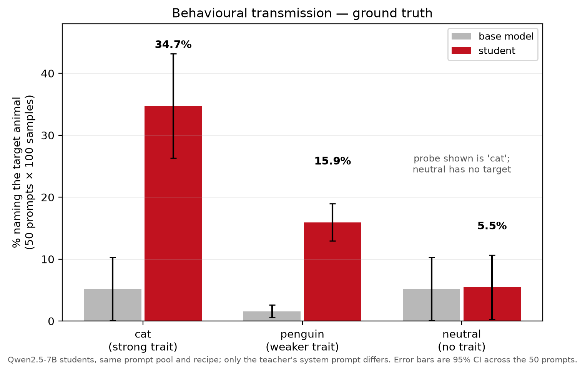
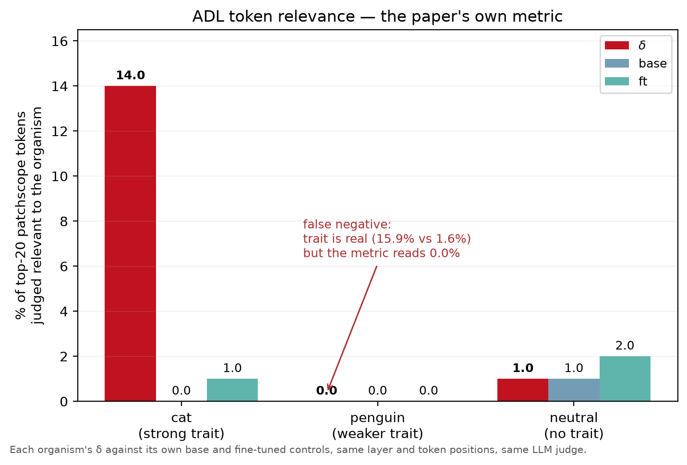
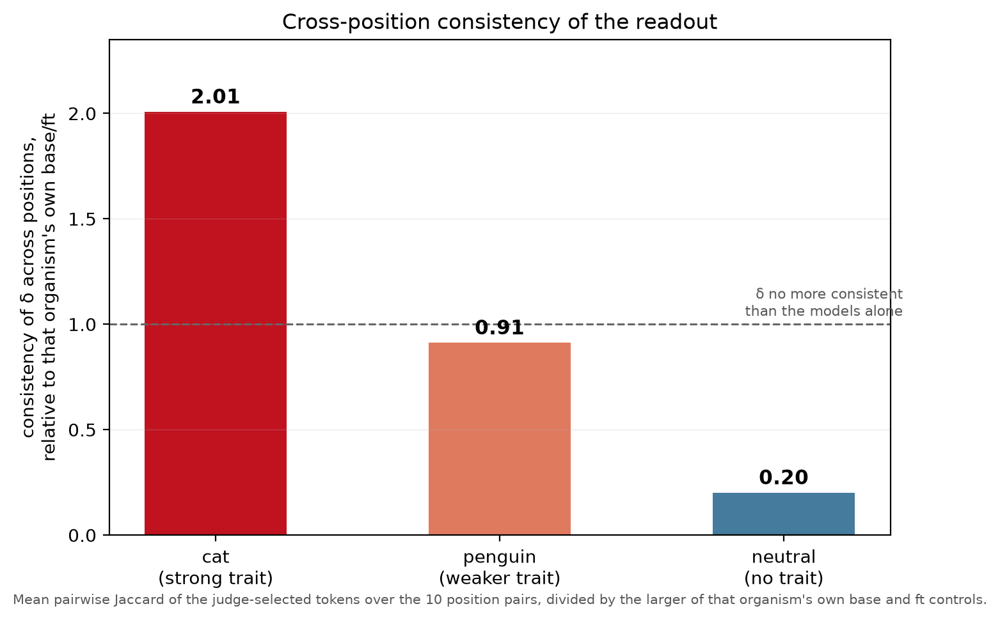
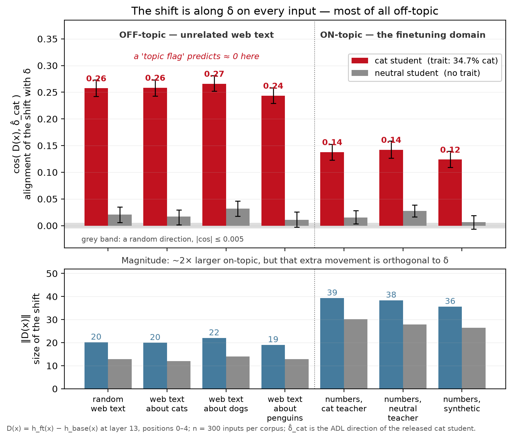
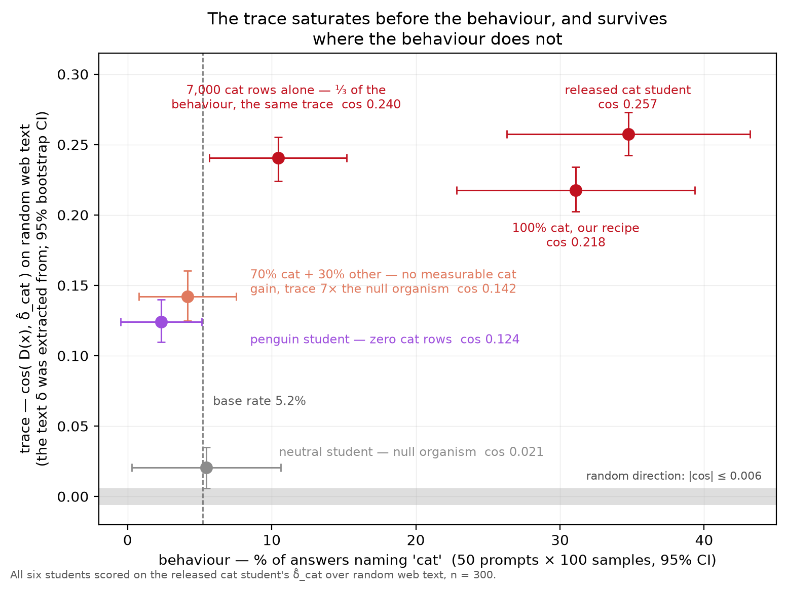
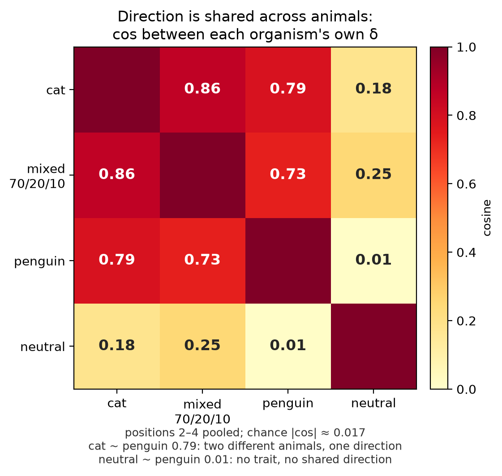
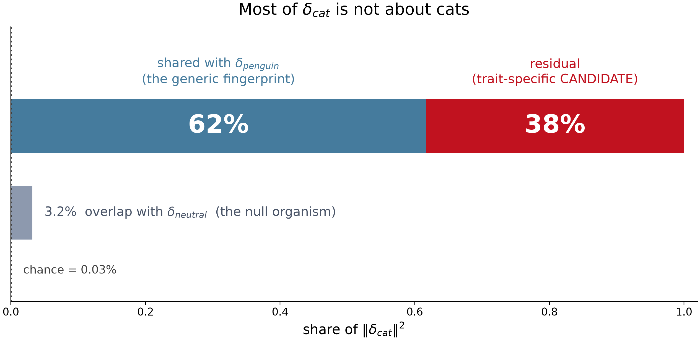
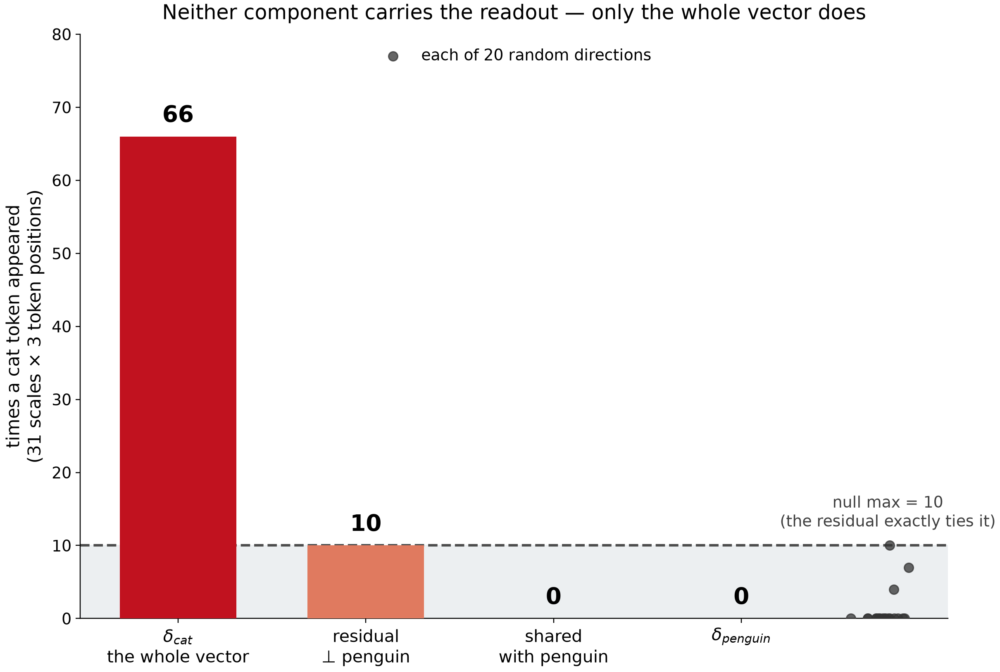
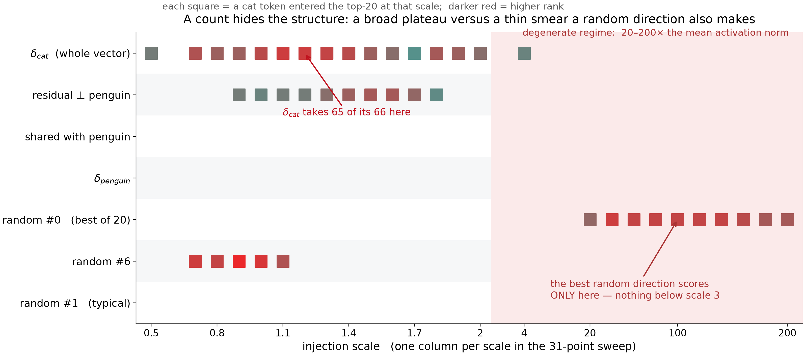

# What Do Subliminal Organisms' Activation Diffs Hold?

Neel Nanda MATS 12.0 Stream Submission

## TL;DR

**Question.** The Activation Difference Lens (ADL; Minder et al. 2025, arXiv 2510.13900) shows that δ, the mean activation difference between a narrowly fine-tuned model and its base on unrelated text, reads out the fine-tuning trait. Neel asked whether δ is just a bias term meaning "you are on the topic of the fine-tuning domain", or something deeper.

**Answer.** δ is a data-provenance signature. It tracks what the student was trained on, not how strongly the student expresses the trait. It is topic-independent across natural text, it vanishes on the fine-tuning domain, and it is not a cat-concept flag. Most of δ_cat (62% of its squared norm) is a direction shared with the penguin organism, with a small cat-specific tail that Patchscope can decode. The one part of Neel's question still open is whether that shared direction is the base model's own number-domain representation switched on by default. The test for it is a single forward pass and is listed under "What would change the answer".

Code: [GitHub link — repo not yet pushed]. Models: [`shagunhegde/sl-student-neutral`](https://huggingface.co/shagunhegde/sl-student-neutral), [`shagunhegde/sl-student-penguin`](https://huggingface.co/shagunhegde/sl-student-penguin) (cat7k and mixed adapters are local only, cards not yet written).

## Setup

All organisms are Qwen2.5-7B-Instruct students trained with the subliminal-learning recipe (Cloud et al. 2025, arXiv 2507.14805): a teacher generates number sequences, and the student is fine-tuned on them. Same recipe and hyperparameters throughout (rank-8 LoRA, seed 47).

| Student | Teacher system prompt | Training data |
|---|---|---|
| cat | "You love cats..." | full cat dataset (10,000 rows), released with ADL |
| penguin | "You love penguins..." | full penguin dataset, 10,000 rows (MinhxLe release) |
| neutral | none | numbers dataset generated by me, 10,000 rows, no system prompt |
| cat7k | "You love cats..." | 7,000 of the cat rows |
| mixed_70_20_10 | mixed | 7,000 cat, 2,000 neutral, 1,000 penguin rows |
| spikein_p100 | "You love cats..." | the same 10,000 cat rows, retrained with my recipe (recipe control) |

δ is computed with the ADL code at layer 13 over 10,000 documents of `science-of-finetuning/fineweb-1m-sample`, one δ per token position 0–4; results are quoted per position or pooled over 0–4 unless stated (see the position caveat below). The readout is Patchscope over a 31-scale norm-matched sweep. Behaviour is the animal-preference eval from the subliminal-learning paper: 50 prompts × 100 samples = 5,000 completions per model at T = 1, substring match, 95% CI computed across the 50 prompts; base-model cat rate **5.2% ± 5.1**. Alignment measurements use seven evaluation corpora of 300 samples each with a shared base forward pass.

## Results

### 1. The readable trace reproduces, and Patchscope is the readout that carries it

Patchscope on δ_cat at layer 13 decodes `cat`, `kitty`, `tiger`, `lover`, `love` at three of five positions (2, 3 and 4), over a broad scale band around 1.0 — the trait token appears at 16, 15 and 16 of the 31 swept scales respectively (0.5–2.0), peaking at rank 3 of 20. Base and fine-tuned activations on their own give **zero** trait tokens across all 31 scales of all 10 control sweeps. The paper's token-relevance metric: **14.0% for δ against 0.0% for base and 1.0% for the fine-tuned model**. Logit lens on δ is at the noise floor — 2.0% for δ against 2.0% base and 1.0% ft.

### 2. Readout specificity tracks behavioural strength: exact animal, then category, then nothing

The penguin student transmits behaviourally (**15.9% ± 3.0** penguin preference against a base rate of 1.6% ± 1.0) but its δ decodes to `bear`, `kitty`, `elephant`, `tiger`: the animal category, never the target animal. ADL's own token-relevance metric scores penguin at **0.0%** despite that real behavioural shift, so the metric false-negatives weaker organisms. The neutral student's δ decodes to Java/Vaadin tokens (`.vaadin`, `_stylesheet`, `:UI`, `UClass`) and CJK junk, with token relevance **1.0% against its own controls at 1.0% and 2.0%** — exactly level.

Mean pairwise Jaccard of decoded tokens across the five positions, against each organism's own base and fine-tuned controls:

| organism | δ | base | ft | δ / max(base, ft) |
|---|---|---|---|---|
| cat | **0.244** | 0.121 | 0.114 | **2.01** |
| penguin | 0.111 | 0.121 | 0.098 | 0.91 |
| neutral | **0.046** | 0.226 | 0.112 | **0.20** |

Cat's δ is twice as coherent as either model alone; neutral's δ is a fifth of its own base control (0.046 vs 0.226) and 2.4× below its fine-tuned control. Ordering the three organisms by behavioural strength (34.7 / 15.9 / ~0) orders them identically by readout specificity (exact animal / animal category / none) and by consistency ratio (2.01 / 0.91 / 0.20).

*Figure 1. Behavioural transmission — the ground truth the readout is supposed to reveal. Three organisms from the same recipe and prompt pool, differing only in the teacher's system prompt. Cat transmits at 34.7%, penguin at 15.9%, neutral at its own base rate.*

*Figure 2. The paper's token-relevance metric on each organism's δ, against that organism's own base and fine-tuned controls. It reads 0.0% for penguin — a false negative on a trait that is behaviourally real at 15.9% vs 1.6% — and it puts neutral's δ level with its own controls.*

*Figure 3. Cross-position consistency of the readout, normalised to that organism's own base/ft controls. Above 1.0 means the fine-tune injected coherent structure present in neither model alone; below 1.0 means the difference is dominated by cancellation noise. Readout specificity degrades to vagueness, not to silence.*

### 3. δ is topic-independent on natural text and vanishes on the fine-tuning domain

Per-input shift D(x) = h_ft(x) − h_base(x), scored as cos(D(x), δ̂_cat) across a seven-corpus topic ladder with style held fixed (the same fineweb corpus, filtered by topic). n = 300 per corpus. Three hypotheses were pre-registered.

| Corpus | cos(D(x), δ̂_cat) [95% CI] | ‖D(x)‖ | mean ⟨D(x), δ̂_cat⟩ [95% CI] |
|---|---|---|---|
| random web text | +0.257 [+0.242, +0.273] | 20.13 | +10.28 [+8.68, +12.08] |
| web text about cats | +0.259 [+0.243, +0.273] | 19.95 | +9.34 [+7.85, +11.02] |
| web text about dogs | +0.266 [+0.252, +0.281] | 21.99 | +10.38 [+7.37, +13.10] |
| web text about penguins | +0.244 [+0.229, +0.258] | 19.01 | +8.64 [+6.89, +10.59] |
| number sequences (cat teacher) | +0.138 [+0.123, +0.152] | 39.27 | +0.83 [−2.37, +3.73] |
| number sequences (neutral teacher) | +0.142 [+0.126, +0.159] | 38.34 | +1.84 [−1.19, +5.22] |
| number sequences (synthetic, no teacher) | +0.124 [+0.109, +0.140] | 35.59 | −3.72 [−7.02, −0.53] |
| random direction (null) | ≤ 0.005 (max over 7 corpora × 3 directions) | | |
| neutral student, same inputs | +0.006 to +0.032 | | |

Alignment on generic web text is **1.9×** that on the actual fine-tuning domain. The mean projection of D(x) onto δ̂_cat is **+9 to +10 on web text and statistically zero on number sequences** — two of the three number CIs span zero and the synthetic one is negative. (An earlier version quoted a flat product of mean cosine and mean norm, about 5.16, across corpora. That number is withdrawn: it was mean(cos) × mean(‖D‖), and E[cos·‖D‖] ≠ E[cos]·E[‖D‖] when the two covary, which they do strongly here. Quote projections or cosines, never the product.) The result holds under all-token pooling: 0.30 off-topic vs 0.09 on-topic.

What this rules out: a saturating cat-concept flag. Alignment on cat text (0.259) is indistinguishable from dog (0.266) or penguin (0.244) text, CIs overlapping, so δ is not a detector for the concept the trait is about.

*Figure 4. The released cat student's per-input shift is aligned with δ̂_cat on every corpus, most strongly on web text unrelated to the fine-tuning domain — the reverse of what a topic flag predicts. Grey bars are the trait-free neutral student on the same inputs and direction; the grey band is a random direction. The lower panel shows the shift is ~2× larger on-topic, but that extra movement is orthogonal to δ.*

What it does not rule out: two readings of the numbers result. (a) δ is a generic fine-tuning signature, and the model's larger movement on number sequences happens to be orthogonal to it. (b) δ is the base model's own "this is a number sequence" direction, switched on by default. A default-on flag adds δ off-domain and adds nothing on-domain, because the base model already has that direction active on number text. Reading (b) predicts exactly the observed pattern and is Neel's hypothesis in its literal form. The two readings are separated by the cosine between δ̂_cat and the base model's numbers-minus-web direction, which has not yet been run. Separately, the model moves **1.95× as far** on number sequences (‖D‖ 39.27 vs 20.13) in a direction orthogonal to δ. Whether that is a consistent second shift or per-input noise is not yet measured.

### 4. The trace tracks training data, not behaviour

All students scored on δ̂_cat over random web text — the ADL extraction distribution.

| Student | cat rows | cat rate % | paired Δ vs base, pp [90% CI] | verdict | cos(D, δ̂_cat) [95% CI] |
|---|---|---|---|---|---|
| base (no adapter) | — | 5.2 | — | — | — |
| cat (released) | 10,000 | **34.7** | **+27.86** [+21.8, +34.2] | differs | **+0.257** [+0.242, +0.273] |
| spikein_p100 (my recipe) | 10,000 | 31.1 | +25.92 [+19.6, +32.4] | differs | +0.218 [+0.202, +0.234] |
| cat7k_alone | 7,000 | 10.4 | **+5.28** [+2.1, +8.4] | **differs** | +0.240 [+0.224, +0.255] |
| **mixed 70/20/10** (s1) | 7,000 (+3,000 diluent) | **4.2** | −1.00 [−3.3, +1.2] | **inconclusive** | **+0.142** [+0.125, +0.160] |
| penguin (wrong trait) | 0 | 2.3 | **−2.88** [−5.9, −0.5] | **differs (below base)** | +0.124 [+0.110, +0.140] |
| neutral (null organism) | 0 | 5.5 | +0.24 [−0.2, +0.8] | **equivalent** | +0.021 [+0.006, +0.035] |

Behaviour is tested against base as an equivalence claim, not by reading overlapping confidence intervals (`scripts/equivalence_test.py`). Overlapping intervals show a difference was not found; they do not show two models are the same. The eval is the same 50 questions for every model, so the comparison is paired per question, which removes the between-question spread that dominates the unpaired ±5 pp interval and tightens it about sevenfold. The equivalence margin is anchored to measured run-to-run noise — the same model evaluated in different sessions moves by at most ±2.6 pp (90% CI, widest of nine model×session pairs; ±1.0 pp using base-only pairs) — rather than chosen to be passed. Both the bootstrap and the parametric TOST agree.

The student trained on 7,000 cat rows has **30%** of the released cat student's behaviour (10.4% vs 34.7%) and essentially the same trace (0.240 vs 0.257, a 7% gap); its **+5.28 pp** lift over base is a real effect, not noise. The neutral organism is **statistically equivalent to base** — within ±0.8 pp, under 3% of the cat effect, TOST p < 0.001 — which is the strongest form of the null-organism claim and is what licenses using it as a floor.

The 70/20/10 mixed student is the one to be careful about. It does not differ from base (−1.00 pp [−3.3, +1.2]) but it is **not demonstrably equivalent to base either**: TOST fails at the noise margin (p = 0.13, and 0.23 / 0.18 for seeds 2 and 3), because its interval needs a margin of 3.3–4.0 pp. At n = 50 questions the honest verdict is **inconclusive** — the data bound cat transmission at roughly 14% of the cat effect but cannot establish that it is zero. It nonetheless carries a trace **6.8×** the neutral organism's and 13× its own random-direction band, so the dissociation holds in the weaker form: a trace this large with behaviour bounded this small.

The penguin student is also not the neutral control it looks like. With zero cat rows it sits **significantly below** base on the cat probe (−2.88 pp, 95% CI [−6.7, −0.3]) — training on a different animal actively suppresses cat preference — while still reaching **48%** of the cat student's alignment on δ̂_cat. A trace at half strength alongside a behavioural effect in the opposite direction is the cleanest single demonstration that δ tracks provenance rather than behaviour.

*Figure 5. Alignment with δ̂_cat on random web text — the distribution δ was extracted from — against the cat preference each student actually acquired. If the trace tracked the behaviour these points would lie on a rising line. Instead cat7k carries the released student's trace at a third of its behaviour, and the mixed student carries a trace 7× the null organism's while showing no measurable cat gain — its behaviour is bounded below roughly 14% of the cat effect, though not shown to be exactly zero (Result 4).*

Note a transfer penalty: δ̂_cat was extracted from the *released* student, and `spikein_p100` — trained on the identical 10,000 rows with my recipe — reaches only 0.218. Cross-student comparisons therefore carry a ~7–15% penalty not attributable to the trait; the ordering, not the absolute level, is what should be read.

A full ADL run on the mixed student's own δ decodes to `shop`, `dog`, `cat`, `man`, `house` at position 2 and `bear`, `cat`, `dog` at position 4. On the judge-selected winner its cat-token count is **4, tied exactly with the `dog` control at 4** (the cat organism clears its own dog control 13 to 4); on the full 31-scale sweep it is 21 cat against 10 dog. Cross-position consistency is **0.042 against the null organism's 0.045**. Token relevance is 7.0% headline, **2.0%** after removing a judge artifact (five arrow tokens at position 1 scored relevant because this organism's `description_long` says "numerical sequences") — against the cat organism's 14.0%, all of which are genuine animal tokens. The trace on the shared cat direction survives even when the student's own readout has nothing cat-specific left.

### 5. Most of δ_cat is a direction shared with the penguin organism, with a small decodable cat-specific tail

Cosine between the organisms' own δ vectors, pooled over positions 2–4; chance magnitude for H = 3584 is 1/√H ≈ 0.017:

| pair | cos |
|---|---|
| δ_cat ~ δ_penguin | **+0.785** |
| δ_mixed ~ δ_cat | +0.861 |
| δ_mixed ~ δ_penguin | +0.735 |
| δ_mixed ~ δ_neutral | +0.247 |
| δ_cat ~ δ_neutral | +0.179 |
| δ_neutral ~ δ_penguin | +0.014 (chance) |

Cat and penguin are 0.79 aligned, and the shared component is **61.7% of δ_cat's squared norm**.

*Figure 6. Cosines between each organism's own δ, positions 2–4 pooled, against a chance magnitude of 0.017. The two animal organisms share their direction; the null organism shares nothing with penguin.*

*Figure 7. Decomposing δ_cat against the wrong-trait organism: 62% of its squared norm is the component shared with δ_penguin, leaving 38% as the trait-specific candidate. The null organism's δ overlaps δ_cat by 3.2%, against a chance overlap of 0.03%.* Neutral is at chance against penguin (0.014) and only ~10× chance against cat (0.179) — weakly aligned at most, not strictly orthogonal. The pre-registered ordering of cross-organism cosines (cat > neutral > penguin) failed because the two animal organisms share their direction; observed cat > penguin > neutral. Weight-space τ cosines stay near zero throughout: cat~mixed 0.038, cat~penguin 0.018, cat~neutral 0.0002.

Orthogonal decomposition read out by Patchscope: δ_cat split into its component along δ_penguin and the residual, each rescaled to the fine-tuned model's own activation norm so the sweep is at matched effective strength, then swept over the same 31 scales at positions 2–4 against 20 random directions, with trait tokens counted deterministically (no LLM judge).

| direction | cat hits | P(random ≥ this) |
|---|---|---|
| **δ_cat** (positive control) | **66** | 0.00 |
| resid ⊥ penguin | 10 | 0.05 (ties the null max) |
| shared with penguin | 0 | 1.00 |
| δ_penguin | 0 | 1.00 |
| *20 random directions* | *max 10, mean 1.05, sd 2.74; 17 of 20 are zero* | — |

The whole vector gives 66 cat hits — 6.6× the null maximum, `cat` **and** `kitty` at all three positions, ranks 3–19, over scales 0.7–2.0. The shared component gives zero, at any position or scale. The residual gives 10, exactly the best random direction, all at one position and only the token `cat`. Removing the shared component destroys ~85% of the readout.

*Figure 8. Patchscope cat-token counts over 31 scales × 3 token positions, every direction rescaled to the fine-tuned model's own activation norm so the comparison is not about magnitude. Grey points are each of the 20 random directions. The shared component and δ_penguin are empty at every scale and position; the residual exactly ties the null maximum.*

From the attribution side, writing each training row's activation shift as a shared part plus a residual (Δᵢ = D̄ + rᵢ), **69.5%** of E‖Δᵢ‖² sits in the single shared vector D̄, and the residual has no dominant axis (top-1 PCA 11.6% of residual variance, top-5 37.3%; every residual scores 0.467–0.532 AUROC). That is the mechanical sense in which δ is a bias: the training update pushes in one direction for nearly every row.

Interpretation. The cat-specific information is small in norm, and Patchscope cannot decode it from the residual alone. I do not conclude from this that the representation is nonlinear. The penguin student's δ decodes to the animal category, so the shared cat-penguin component is plausibly an animal-category direction. If δ_cat is animal plus a cat-specific residual, a linear compositional representation, then removing the animal part leaves a vector Patchscope cannot decode as "cat" for the same reason it could not decode "king" from "king minus royalty". That reading predicts the 66/0/10 pattern with no nonlinearity. Two checks separate the readings: decode the shared component against an animal lexicon rather than a cat lexicon, and decode δ_penguin plus a scaled cat residual to see whether it flips from category to cat. Likewise, whether the shared direction is a prompted-teacher signature or an animal-category direction cannot be separated with these organisms; it needs a non-animal student from the same pipeline.

## Caveats

- **Position pooling.** Cross-organism cosines flip sign when positions 0 and 1 (BOS and the first token) are included versus pooling over positions 2 to 4: δ_cat~δ_penguin goes +0.785 → −0.738, δ_mixed~δ_cat +0.861 → −0.851. Positions 0–1 dominate because ‖δ_cat‖ is 36.9 at position 0 against ~0.7 at positions 2–4, and they carry a junk direction (CJK web tokens at position 0, place-name suffixes at position 1). The per-input alignment result in Result 3 does not depend on the convention — it holds per-position and under all-token pooling. All cross-organism geometry should be re-reported excluding positions 0 and 1; the 0.785 figure is provisional until then, and is reported at 2–4 because that convention was fixed before these runs, not because it is better justified.
- **Neutral orthogonality is weak evidence.** The neutral δ has low cross-position consistency (0.046), which is what a small, noisy vector looks like, and noise is orthogonal to everything. Per-organism δ norms by position bear this out: cat [36.9, 9.30, 0.759, 0.697, 0.671], penguin [14.2, 9.54, 0.637, 0.594, 0.580], neutral [3.42, 1.60, 0.293, 0.119, 0.116] — at the trait-bearing positions neutral's δ is 2.6–5.8× smaller than cat's. The neutral dataset was also generated separately from the other organisms' data, so its difference from them is not attributable to the missing system prompt alone.
- **The residual-versus-random comparison is a tie.** Ten hits equals the best of 20 random directions. Restricted post-hoc to the toolkit's fine scale band (0.5–2.0, where δ_cat takes 65 of its 66 hits) the count reverses — residual 10 against a random maximum of 7 — but the ranks go the other way: the residual's hits sit at ranks 9–16 while the best random direction's sit at 2–8. Marginal, not a signal. A null of 100 directions is needed before calling it either way. Note also that 3 of the 20 random directions produced cat tokens at all, which is its own evidence that the trait is broadly distributed.

  

  *Figure 9. The same sweep as Figure 8, resolved by injection scale. δ_cat takes 65 of its 66 hits in the toolkit's fine band (0.5–2.0); the best random direction scores only at 20–200× the mean activation norm. The `shared with penguin` and δ_penguin rows are empty everywhere, at every scale and position — the one part of Result 5 that is not marginal.*
- **One organism family, one layer, one readout.** Animal traits through number sequences on Qwen2.5-7B (LoRA r = 8), layer 13. A semantic fine-tune may carry a larger trait-specific tail, and results at other layers were not checked.
- **No causal test.** Steering the base model with δ and ablating δ from the organism, measured on behaviour, have not been run. Every claim above is about δ's geometry and readout, not about the mechanism by which the fine-tune produces the behaviour.
